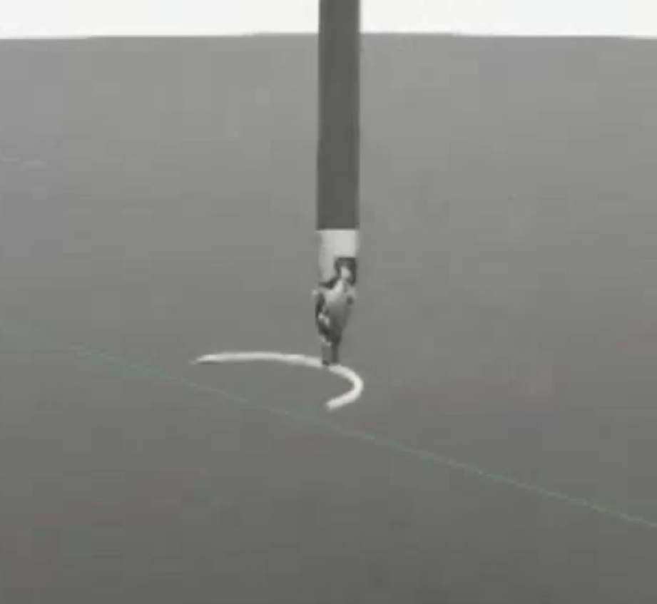
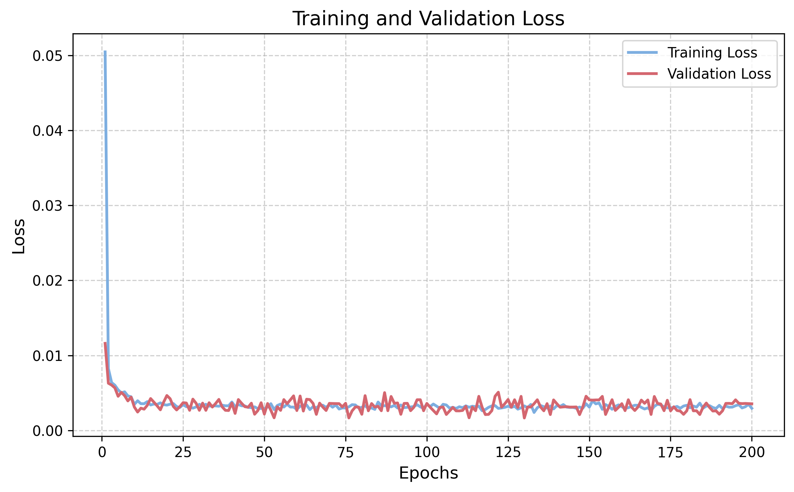

# Learning-Based Surgical Needle Manipulation in ORBIT-Surgical

[](https://docs.omniverse.nvidia.com/isaacsim/latest/overview.html)
[](https://isaac-sim.github.io/IsaacLab)
[](https://docs.python.org/3/whatsnew/3.10.html)
[](https://releases.ubuntu.com/22.04/)

## Overview

This repository extends the ORBIT-Surgical framework with a complete learning pipeline for surgical needle manipulation in Isaac Lab. The pipeline includes a state-machine baseline, automatic demonstration collection, imitation learning with RoboMimic, reinforcement learning with RSL-RL, and automatic checkpoint evaluation on the Lift Needle benchmark.

### Highlights

- State machine benchmark for surgical needle manipulation
- Automatic HDF5 demonstration dataset generation 
- RoboMimic Behavior Cloning (BC)
- RSL-RL Proximal Policy Optimization (PPO)
- Skrl Twin-Delayed Deep Deterministic (TD3)
- Automatic checkpoint evaluation
- Policy performance comparison

### Pipeline


## Setup

Once you are in the virtual environment, you do not need to use `${IsaacLab_PATH}/isaaclab.sh -p` to run python scripts. You can use the default python executable in your environment by running `python` or `python3`. However, for the rest of the documentation, we will assume that you are using `${IsaacLab_PATH}/isaaclab.sh -p` to run python scripts.

<!-- Download and install the [Git Large File Storage (LFS)](https://git-lfs.com/). Once downloaded and installed, set up Git LFS for your user account by running:
```bash
git lfs install
``` -->

Clone this repository to a directory **outside** the Isaac Lab installation directory:

```bash
git clone https://github.com/LenaASu/orbit-surgical.git
```

### Repository Structure

- **state_machine/** – state machine benchmark 
- **data/** – demonstration datasets in HDF5 format
- **robomimic/** – BC demonstration collection, training, visualization and evaluation
- **rsl_rl/** – PPO training and evaluation
- **skrl/** – TD3 training and evaluation
- **media/** – figures and benchmark videos

## Benchmark (State Machine)

<p align="center">
  
</p>

The state machine baseline successfully grasps and lifts a suture needle and is used to generate demonstration trajectories for imitation learning.

### Benchmark Video
https://github.com/user-attachments/assets/07509bdc-0bed-4780-8f30-1dbccac22174

## Imitation Learning
### Dataset
The demonstrations are automatically converted into a RoboMimic-compatible HDF5 dataset for offline imitation learning.

| Item | Value |
|------|------|
| Demonstrations | 200 |
| Observation dimension | 34 |
| Action dimension | 8 |
| Environment | Isaac-Lift-Needle-PSM-IK-Abs-v0 |
| Collector | State Machine |

### Behavior Cloning (BC)

1. Collect demonstrations with state machine for the environment `Isaac-Lift-Needle-PSM-IK-Abs-v0`:

```bash
${IsaacLab_PATH}/isaaclab.sh -p source/standalone/workflows/robomimic/collect_demos.py --task Isaac-Lift-Needle-PSM-IK-Abs-v0 --num_envs 1 
```

2. Split the dataset into train and validation set: 

```bash
# split data
${IsaacLab_PATH}/isaaclab.sh -p source/standalone/workflows/robomimic/tools/split_train_val.py logs/robomimic/Isaac-Lift-Needle-PSM-IK-Abs-v0/hdf_dataset.hdf5 --ratio 0.1
```

3. Train a BC agent for `Isaac-Lift-Needle-PSM-IK-Abs-v0`. 

```bash
${IsaacLab_PATH}/isaaclab.sh -p source/standalone/workflows/robomimic/train.py --task Isaac-Lift-Needle-PSM-IK-Abs-v0 
```

4. Visualize a trained checkpoint:

```bash
${IsaacLab_PATH}/isaaclab.sh -p source/standalone/workflows/robomimic/play.py --task Isaac-Lift-Needle-PSM-IK-Abs-v0 --checkpoint /PATH/TO/model.pth
```

5. Evaluate trained checkpoints:

```bash
${IsaacLab_PATH}/isaaclab.sh -p source/standalone/workflows/robomimic/eval.py --task Isaac-Lift-Needle-PSM-IK-Abs-v0 --checkpoint_dir logs/robomimic/models
```

## Reinforcement Learning
### PPO

Train an agent on `Isaac-Lift-Needle-PSM-IK-Abs-v0`:

```bash
# run script for training
${IsaacLab_PATH}/isaaclab.sh -p source/standalone/workflows/rsl_rl/train.py --task Isaac-Lift-Needle-PSM-IK-Abs-v0 --headless
# run script for playing with 32 environments
${IsaacLab_PATH}/isaaclab.sh -p source/standalone/workflows/rsl_rl/train.py --task Isaac-Lift-Needle-PSM-IK-Abs-v0 --num_envs 32 
```

### TD3


## Results

The following results were evaluated on the Lift Needle task in **50 episodes**. 

| Method | Success Rate |
|----------|----------|
| State Machine | 68% |
| BC (200 demos) | 20% |
| PPO | 82% |

### BC Training

<p align="center">

</p>

Training and validation losses converge rapidly without noticeable overfitting.

## Future Work

- Additional RL algorithms (TD3, SAC)
- Offline RL (TD3-BC, BCQ)
- Interactive imitation learning (DAgger)
- Adversarial imitation learning (GAIL)
- Diffusion Policy
- Vision-based policy learning
- Sim-to-real transfer

## Acknowledgement

NVIDIA Isaac Sim is available freely under [individual license](https://www.nvidia.com/en-us/omniverse/download/). For more information about its license terms, please check [here](https://docs.omniverse.nvidia.com/app_isaacsim/common/NVIDIA_Omniverse_License_Agreement.html#software-support-supplement).

Isaac Lab is released under [BSD-3-Clause License](https://github.com/isaac-sim/IsaacLab/blob/main/LICENSE).

Project template is partially from [Template for Isaac Lab Projects](https://github.com/isaac-sim/IsaacLabExtensionTemplate).

ORBIT-Surgical [framework](https://github.com/orbit-surgical/orbit-surgical) and [paper](https://arxiv.org/abs/2404.16027).
